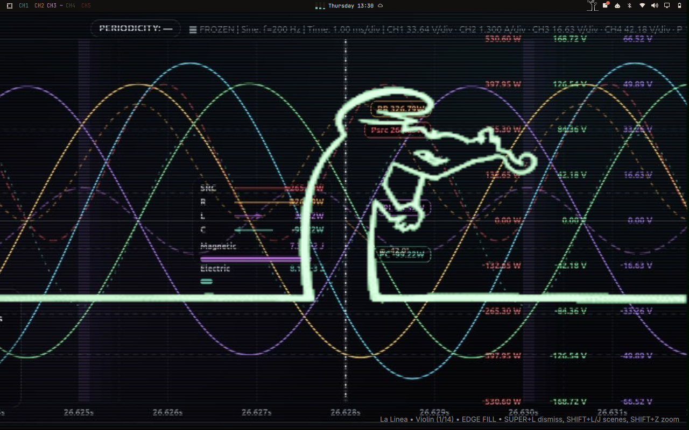

# omaLinea — La Linea Walker for Omarchy

An Omarchy shell plugin that brings Osvaldo Cavandoli's **La Linea** to your
desktop: he walks the bottom of your screen, argues with his creator's hand,
and rants in Carlo Bonomi's unmistakable gibberish.

> **Unofficial fan tribute.** Not affiliated with the rights holders.
> Footage and audio are cut from the user's own copy for personal,
> non-commercial desktop use. Grazie, Maestro.



## Features

- **14 keyed scenes** — transparent GIFs cut from original footage, each with
  its original rant audio (looped via `mpv`)
- **Click-through overlay** — he never steals clicks from your windows
- **Native stage + edge fill** — crisp bottom-stage look by default,
  stretch-to-edges zoom on demand
- **Animated bar icon** — a standing La Linea living in your bar; every
  5–18s he randomly bows, hops, or stands straight
- **Tribute card** — click the bar icon for a native Omarchy dropdown
  honoring Cavandoli, with a link back to this repo
- **Scene cycling** — flip through all 14 scenes without touching the mouse

## Scenes

| # | Name | Length |
|---|------|--------|
| 0 | Violin | 28s |
| 1 | Car repair | 40s |
| 2 | Umbrella | 35s |
| 3 | Piano | 30s |
| 4 | Car push | 35s |
| 5 | Trumpet | 40s |
| 6 | Fight cloud | 40s |
| 7 | Car stack | 40s |
| 8 | Trapeze | 40s |
| 9 | Steps | 35s |
| 10 | Duel | 30s |
| 11 | Beers | 30s |
| 12 | Ball | 30s |
| 13 | Tennis | 22s |

## Keybindings

| Keys | Action |
|------|--------|
| `SUPER + L` | Summon / dismiss La Linea |
| `SUPER + SHIFT + L` | Next scene |
| `SUPER + SHIFT + J` | Previous scene |
| `SUPER + SHIFT + Z` | Toggle native size ↔ edge-to-edge zoom |

Direct summon also works, e.g.:

```bash
omarchy-shell shell summon rene.lalinea '{"scene":10}'
omarchy-shell shell summon rene.lalinea '{"action":"fill"}'    # force zoom
omarchy-shell shell summon rene.lalinea '{"action":"stage"}'   # force native
```

## Install

Requirements: [Omarchy](https://omarchy.org/) (Quickshell shell) and `mpv`
for the rant audio.

1. Standard install (recommended):
   ```bash
   omarchy plugin add https://github.com/ariDev1/omaLinea.git --enable
   omarchy plugin validate ~/.config/omarchy/plugins/rene.lalinea
   ```
   Manual alternative:
   ```bash
   git clone https://github.com/ariDev1/omaLinea.git
   cp -r omaLinea ~/.config/omarchy/plugins/rene.lalinea
   omarchy plugin validate ~/.config/omarchy/plugins/rene.lalinea
   ```
2. Register it in `~/.config/omarchy/shell.json`:
   ```json
   "plugins": [{ "id": "rene.lalinea" }]
   ```
   and add `{ "id": "rene.lalinea" }` to `bar.layout.right` for the bar icon.
3. Add the keybindings to `~/.config/hypr/bindings.lua`.
   `omarchy plugin add --enable` does **not** install Hyprland keybindings —
   this step is required, otherwise `SUPER+L` keeps doing its default
   workspace-layout toggle and the other keys do nothing.
   (`SUPER+L` needs `hl.unbind("SUPER + L")` first — it replaces the
   workspace-layout toggle.) Copy-paste block:
   ```lua
   -- omaLinea — La Linea Walker (https://github.com/ariDev1/omaLinea)
   -- SUPER+L was previously bound to Toggle workspace layout, unbound below.
   hl.unbind("SUPER + L")
   o.bind("SUPER + L", "La Linea toggle", "omarchy-shell shell toggle rene.lalinea")
   o.bind("SUPER + SHIFT + L", "La Linea next scene", "omarchy-shell shell summon rene.lalinea '{\"action\":\"next\"}'")
   o.bind("SUPER + SHIFT + J", "La Linea prev scene", "omarchy-shell shell summon rene.lalinea '{\"action\":\"prev\"}'")
   o.bind("SUPER + SHIFT + Z", "La Linea zoom toggle", "omarchy-shell shell summon rene.lalinea '{\"action\":\"toggleFill\"}'")
   ```
   Verify with: `omarchy menu keybindings --print | grep "La Linea"`
4. Apply:
   ```bash
   hyprctl reload && hyprctl configerrors
   omarchy restart shell
   ```

## Update

```bash
omarchy plugin update rene.lalinea
omarchy restart shell
```

## Removal

```bash
omarchy plugin remove rene.lalinea
```

Removal deletes the plugin directory. Your `shell.json` entry, bar layout
entry, and Hyprland keybindings are yours — remove those lines too if you
don't want them. Nothing else is left behind: no services, no timers, no
files outside the plugin directory (the rant `mpv` process exits with the
overlay and is reaped on shell start).

## Adding scenes

Quickshell's `AnimatedImage` decodes **every GIF frame to RAM**
(~400×320×4 bytes each). Keep cuts renderable:

- max **~400 frames at 400px wide** or the scene goes black/frozen
- longer scene? widen the timestamp and **lower the fps**
  (e.g. 60s at 6fps = 360 frames), never raise the resolution
- key the background with `colorkey`, generate a palette, verify a frame
  has clean transparency before shipping

To look bigger on screen, scale in QML (GPU, free) instead of
re-encoding bigger files.

## Credits

- **Osvaldo Cavandoli (1920–2007)** — creator of La Linea (first aired 1969)
- **Carlo Bonomi** — voice of the rant
- Built for the [Omarchy](https://omarchy.org/) community with love

## Support & security

- Bugs and ideas: [GitHub issues](https://github.com/ariDev1/omaLinea/issues)
- Security: this plugin runs unsandboxed inside the Omarchy shell (like all
  shell plugins). It launches one local process — `mpv` for rant audio, no
  network access, no credentials. Report concerns via GitHub issues; do not
  post credentials anywhere.

## Compatibility

Tested on Omarchy 4.0.4 (Quattro shell), single monitor. No unbounded
claims — if you run another version, `omarchy plugin validate` plus a
summon/hide cycle is the 30-second check.
